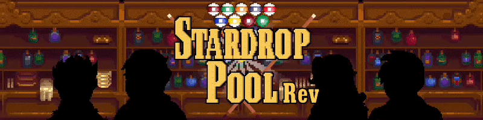

<p align="center">
  
</p>

<p align="center">A playable 8-ball minigame for the pool table in Stardrop Saloon.</p>

<p align="center">
  <a href="https://github.com/andyruwruw/stardew-valley-stardrop-pool-minigame">Original Repo</a> · <a href="https://www.nexusmods.com/stardewvalley/mods/49140">Nexus</a> · <a href="https://github.com/soizo/StardropPoolMinigameRev/issues">Issues</a>
</p>

# Stardrop Pool Minigame Rev

A Stardew Valley SMAPI mod that turns the Stardrop Saloon pool table into an 8-ball minigame. Play solo, challenge an NPC, or watch NPCs play.

## Features

- 8-ball pool with solo, NPC opponent, and NPC watch modes.
- Play with Sam, Sebastian, Abigail, or Gus (two hearts required to invite an NPC).
- Custom cues, NPC emotes, and Generic Mod Config Menu options.
- Matches persist for the current in-game day.

## Playing

Interact with the pool table in the Stardrop Saloon. Click and drag to aim and set power; release to shoot. Press **Y** to open or close the emote menu.

Controller support, keyboard-only play, and Farmer-versus-Farmer multiplayer are planned but not available.

## Installation

Download the latest release from [Nexus Mods](https://www.nexusmods.com/stardewvalley/mods/49140), then extract the `StardropPoolMinigameRev` folder into Stardew Valley's `Mods` folder.

## Building

Requires .NET 6, Stardew Valley 1.6, and SMAPI 4.x development references. Build with:

```sh
dotnet build StardropPoolMinigameRev.csproj -c Release
```

To create the package layout, run `./package.sh`.

## Credits and licence

- Inspired by [stardew-valley-stardrop-pool-minigame](https://github.com/andyruwruw/stardew-valley-stardrop-pool-minigame) and [Mating 8 Ball Pool](https://github.com/brunogrbavac/Mating-8-Ball-Pool).
- Additional eye-emote variants: [OwO Emote](https://www.nexusmods.com/stardewvalley/mods/9848).
- [LICENSE](LICENSE) applies only to this project's original source code. See [NOTICE.md](NOTICE.md) for third-party material provenance.
